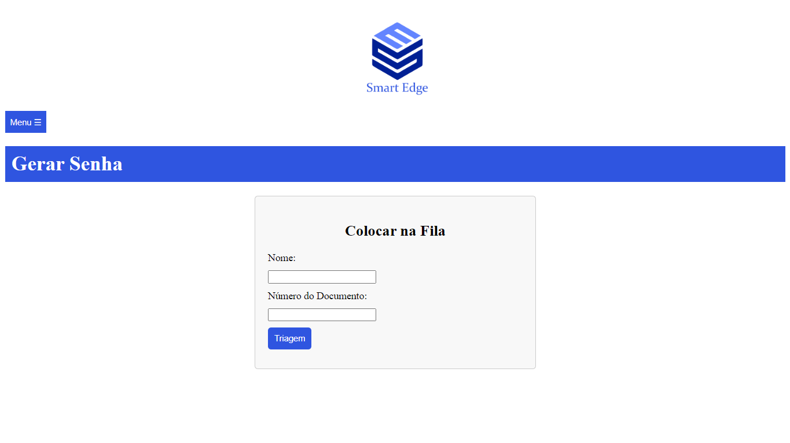
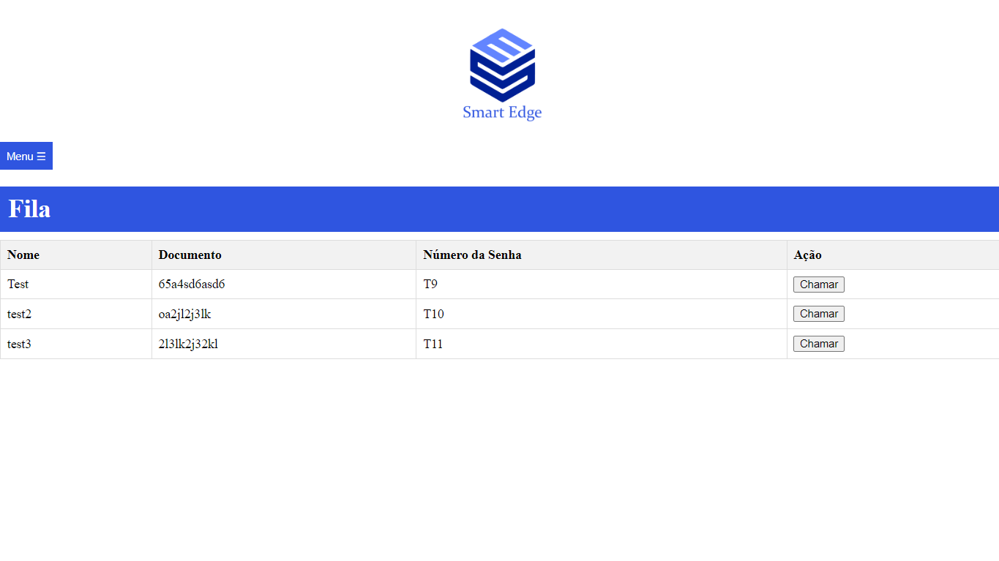
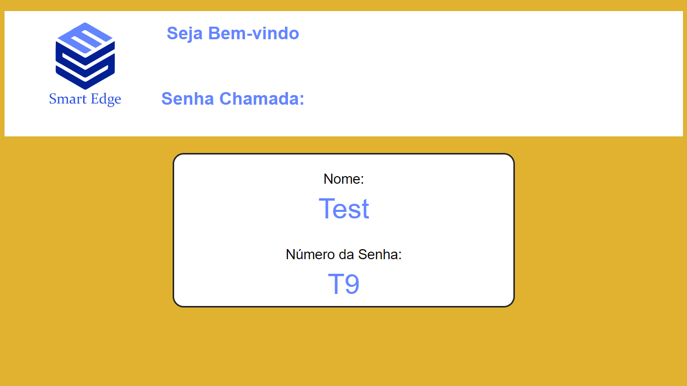
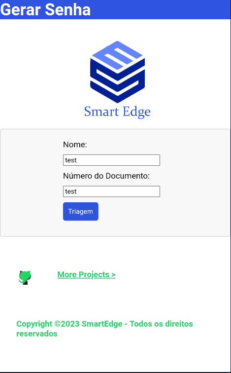
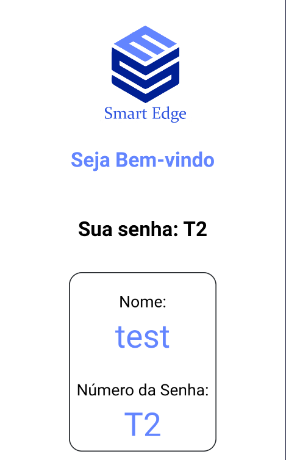

# SmartEdge-Painel-senha
<br />
<p align="center">
  </a>
</img>
  </a>

  <h3 align="center">queue management system</h3>

  <p align="center">
    Easy solution for problems for in-person queues
  </p>
</p>

---
### Table of contents
- [SmartEdge-Painel-senha](#smartedge-painel-senha)
    - [Table of contents](#table-of-contents)
  - [About The Project](#about-the-project)
    - [Built With](#built-with)
    - [Web queue triage](#web-queue-triage)
    - [Web queue view](#web-queue-view)
    - [Totem Smartphone](#totem-smartphone)
    - [How to Start the Server?](#how-to-start-the-server)

---

## About The Project
this project allows you to generate tickets for a person, with their name and document number, so that you can call the panel, as needed at the moment, when making the call, it is automatically redirected to the ticket visualization panel, so playing a sound effect to let the person know you called them.

<br />

Is used an API builded in Flask to register new ticket on queue and call the next person on queue.

---

### Built With

* [Python](https://python.org)

---

### Web queue triage
Here is where we can put the person's data so we can call later.

<br />

<p align="center">
</a>
</img>
</a>
</p>
<br />
After that we can see the generated tickt for the person, we can call the tickt in any order.

<br />
<br />

<p align="center">
</a>
</img>
</a>
</p>

---

### Web queue view
After we call the ticket, we have to see the ticket called and to see that have the web queue view, here is where we can see the ticked number and the name of person called. After each ticked called, have a song effect to alert that web panel is calling someone.

<br />

<p align="center">
</a>
</img>
</a>
</p>

---

### Totem Smartphone

This can be used to user get your password, generating with your name and document number,

<br>
<p align="center">
</a>
</img>
</a>
<br>

</p> after that the person get acess to a panel that only she, who generate the ticket can view, when the password is called and the ticket that is holding is equal to what is called, the screen begin to pulse to alert the user.


<br>

<p align="center">
</a>
</img>
</a>


---

### How to Start the Server?

First acess the directory what the file is in your prompt, and install the dependences with:
```
pip install -r requirements.txt
```
Now just start the **main.py**

and go to your browser, the ports for the aplications are:

- *machine_ip*:5001 <br>
  is the api server

- *machine_ip*:5001 <br>
  Is the Web queue view

- *machine_ip*:5002 <br>
  Is the Web queue triage
- *machine_ip*:5003 <br>
  Is the Totem Smartphone

---