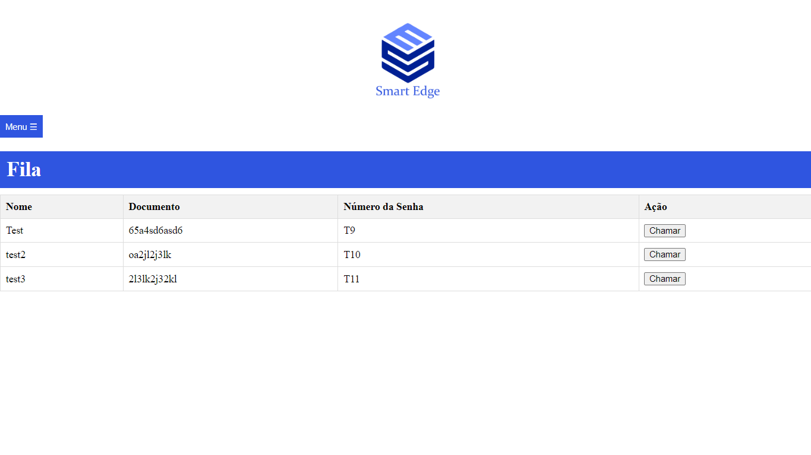

# SmartEdge-Painel-senha
 

  </a>
</img>
  </a>

  <h3 align="center">queue management system</h3>

  

    Easy solution for problems for in-person queues
  

---

## About The Project
this project allows you to generate tickets for a person, with their name and document number, so that you can call the panel, as needed at the moment, when making the call, it is automatically redirected to the ticket visualization panel, so playing a sound effect to let the person know you called them.

---

### Built With

* [Python](https://python.org)

---
### web queue screening
Here is where we can put the person's data so we can call later.

 

</a>
</img>
</a>

 
After that we can see the generated tickt for the person, we can call the tickt in any order.

 
 

</a>
</img>
</a>

### web queue view
After we call the ticket, we have to see the ticket called and to see that have the web queue view, here is where we can see the ticked number and the name of person called. After each ticked called, have a song effect to alert that web panel is calling someone.

</a>
</img>
</a>

